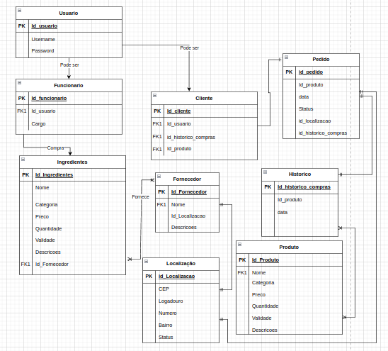

# Tradizion-Restaurante
Sistema para monitoramento de estoque em um restaurante 
# Big picture. 

## Nesta imagem está descrita a modelagem de dados no software. 
## A partir deste modelo faremos as funcionalidades 
- login (Cliente e Funcionario)(CRUD).
- Estoque para ingredientes - ingredientes (funcionario)(CRUD).
- Pratos disponiveis - Produto(Funcionario)(CRUD).
- Realização da Compra - pedidoPrato(Cliente)(CRUD). 
- Acompanhamento do status do pedido(Cliente). 
- Mudança do status do pedido(Funcionario). 

### Funções do CRUD : 
- Criar.
- Ler.
- Atualizar.
- Deletar.
### Um exemplo sobre a utilização do CRUD no login. 
- Criar um usuário. 
- Ler/Buscar esse dado no Banco de dados para fazer o login
- Atualizar dados de um usuário. 
- Excluir um usuário.