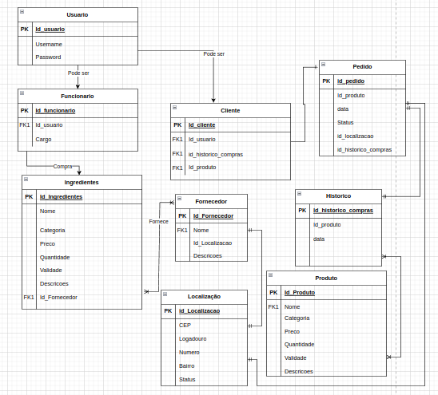

# Tradizion-Restaurante
Sistema para monitoramento de estoque em um restaurante 
# Big picture. 
## Nesta imagem está descrita a modelagem de dados no software. 
## A partir deste modelo faremos as funcionalidades 
- login (Cliente/Funcionario)
- Estoque para ingredientes (CRUD).
- Pratos disponiveis (CRUD).
- Compra (Cliente). 
- Acompanhamento do status do pedido(Cliente). 
- Mudança do status do pedido(Funcionario). 
